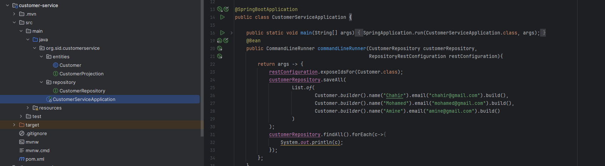
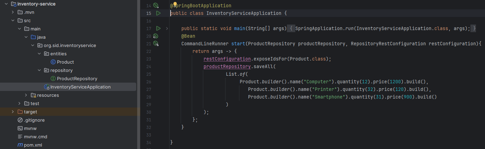
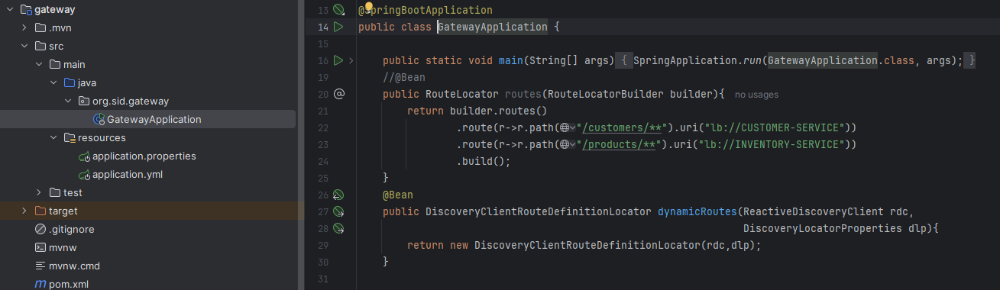
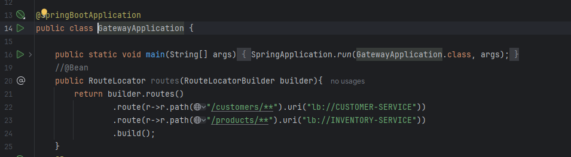
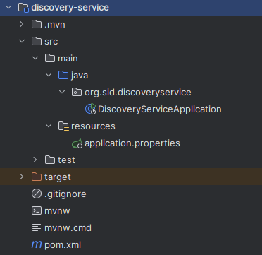
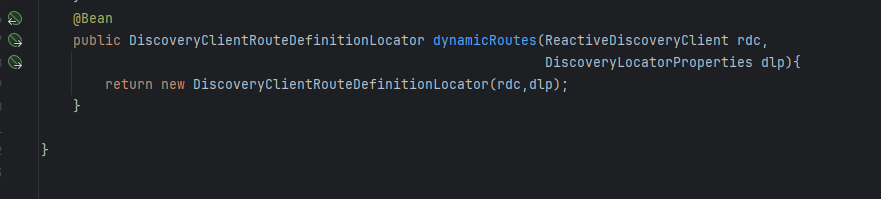
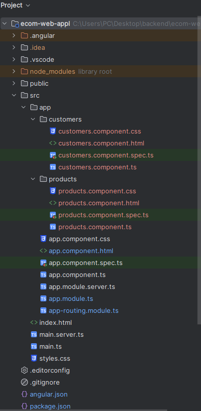
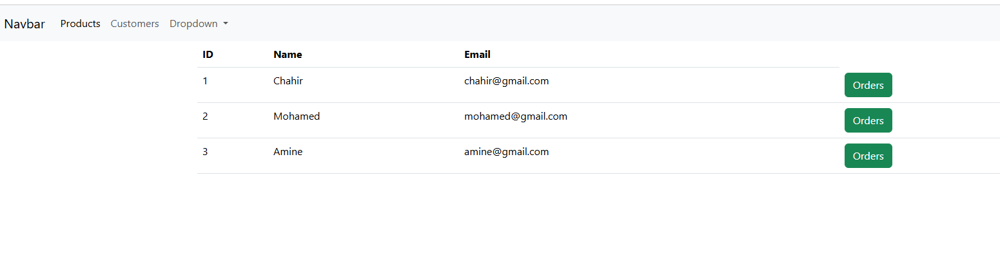

<h2>Micro-services Ecommerce App</h2>
<h3>1. Créer le micro-service customer-service qui permet de gérer les client
</h3>

<h3>2. Créer le micro-service inventory-service qui permet de gérer les produits
</h3>

<h3>3. Créer la Gateway Spring cloud Gateway
</h3>

<h3>4. Configuration statique du système de routage
</h3>

<h3>5. Créer l'annuaire Eureka Discrovery Service
</h3>

<h3>6. Faire une configuration dynamique des routes de la gateway
</h3>

<h3>9. Créer un client Angular
</h3>

